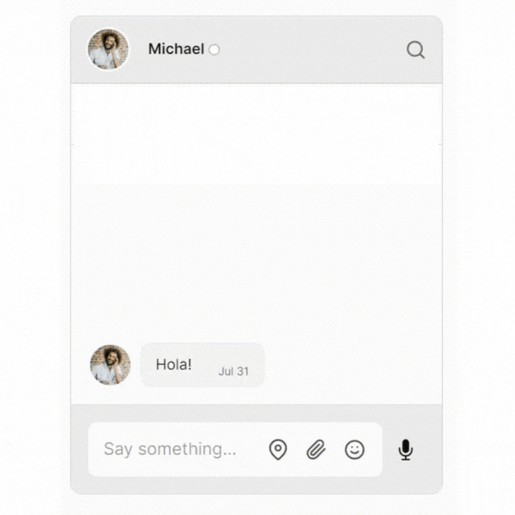

# How to add chat to a Blazor Web app with TalkJS 


Do you want to quickly set up a chat in your Blazor application in minutes? If yes is your answer, then you’re in the right place.


<figure class="kg-image-card">
  
  <figcaption>Blazor application with TalkJS</figcaption>
</figure>
<br/>
<br/>

In this tutorial we’ll demonstrate how to add a Chat API to a Blazor Web Application using TalkJS. TalkJS is a chat API that offers lots of features and is easy to integrate. Today, we are going to talk about integrating TalkJS to a Blazor application. Without further ado, let’s begin.

This tutorial assumes that you have knowledge of Blazor, .NET and also that you’re familiar with the basics of Javascript, HTML and CSS. 

To follow along, you’ll need:
-	A [TalkJS account](https://talkjs.com/dashboard/login). TalkJS provides a ready-to-use chat client for your application. Your account gives you access to TalkJS's free development environment.
- .NET 8 [SDK](https://dotnet.microsoft.com/en-us/download/dotnet/8.0).
-	A Blazor Web App in which you would like to add a chat to.

This Blazor application is created using the Blazor Web App template in Visual Studio, specifically Interactive server with Per page/component interactivity. The steps of creating one can be found in this [Microsoft Blazor tutorial link](https://dotnet.microsoft.com/en-us/learn/aspnet/blazor-tutorial/create). 

If you already have an existing application created using the Blazor Web App template, you can still follow along and tweak the render modes depending on where your component displaying the chat will be.

We’ll build up the chat step by step in the following sections. If you would rather see the complete example code, see the [GitHub repo -NOT UPDATED](https://github.com/MagnusMutai/tutorials/edit/main/how-to-add-chat-to-a-blazor-app-with-talkjs) for this tutorial. 
This is a tutorial just to get you started. For a fine-grained explanation, please follow the comments in the code.

# Initialize TalkJS 
In this section we are going to activate TalkJS. To do this, in the `body` tag of `app.razor`, add the following script tag containing the JavaScript code that activates TalkJS in your Blazor application.

```html
<body>
    <Routes />
    <script src="_framework/blazor.web.js"></script>

    @* Initialize TalkJS *@
    @* Minified snippet to load TalkJS without delaying your page *@
    @* This code needs to be below the Talk.Wrapper Code above for it work appropriately *@
    <script>
        (function (t, a, l, k, j, s) {
            s = a.createElement('script'); s.async = 1; s.src = 'https://cdn.talkjs.com/talk.js'; a.head.appendChild(s)
                ; k = t.Promise; t.Talk = {
                    v: 3, ready: {
                        then: function (f) {
                            if (k) return new k(function (r, e) { l.push([f, r, e]) }); l
                                .push([f])
                        }, catch: function () { return k && new k() }, c: l
                    }
                };
        })(window, document, []);
    </script>

</body>
```

# Create a conversation

Next, in `app.razor` we will add another script tag that creates the actual conversation. This script will consist of a JavaScript wrapper called `TalkWrapper` (A JavaScript Wrapper is a function that calls one or more other functions.)  

Inside `TalkWrapper`, we are going to define a function called `createConversation`.This function contains the logic to create a conversation. It receives four parameters which will be provided by our C# code that will call it. Here is the code:

```html
<body>
    <Routes />
    <script src="_framework/blazor.web.js"></script>

    @* Create a conversation *@
    <script>
        window.TalkWrapper = {

            createConversation: function (appId, myUser, otherUser, conversationId) {

                // Create a Talk.User object for me
                const me = new Talk.User(myUser);
                //Create a Talk.User object for other participant
                const other = new Talk.User(otherUser);

                // Create a Talk.Session object
                const talkSession = new Talk.Session({
                    appId: appId,
                    me: me,
                });

                // Create a conversation with a unique conversation ID
                const conversation = talkSession.getOrCreateConversation(conversationId);

                // Add myself as a participant
                conversation.setParticipant(me);

                // Add another participant
                conversation.setParticipant(other);

                const chatbox = talkSession.createChatbox();
                chatbox.select(conversation);
                // Mount a conversation into a given div
                //We're getting the div by id, make sure the div has the id specified i.e talkjs-container
                chatbox.mount(document.getElementById('talkjs-container'));
            }
        }

    </script>

    @* Initialize TalkJS *@
    @* Minified snippet to load TalkJS without delaying your page *@
    @* This code needs to be below the Talk.Wrapper Code above for it work appropriately *@
    <script>
        (function (t, a, l, k, j, s) {
            s = a.createElement('script'); s.async = 1; s.src = 'https://cdn.talkjs.com/talk.js'; a.head.appendChild(s)
                ; k = t.Promise; t.Talk = {
                    v: 3, ready: {
                        then: function (f) {
                            if (k) return new k(function (r, e) { l.push([f, r, e]) }); l
                                .push([f])
                        }, catch: function () { return k && new k() }, c: l
                    }
                };
        })(window, document, []);
    </script>


</body>
```
# Create a user model

That’s enough JavaScript for now. 

For the sake of simplicity, we are going write the rest of the C# code and HTML to display the component under the default `Home.razor` page.

Now, add a data model of a typical [user](https://talkjs.com/docs/Reference/Concepts/Users/) in a TalkJS conversation. To do so, create a class named `User` as shown below and add the given properties.

```c#
@code {
    //Model for a typical chat participant
    public class User
    {
        public long Id { get; set; }
        public string Name { get; set; } = string.Empty;
        public string Email { get; set; } = string.Empty;
        public string PhotoUrl { get; set; } = string.Empty;
        public string WelcomeMessage { get; set; } = string.Empty;
    }
}
```

# Create User instances

Still under `Home.razor`, we are going to create instances of the User class defined above. After that, we are going to assign them to properties of the User type. These instances are hard-coded and we are assigning relevant user values to the
`Id`, `Name`, `Email`, `PhotoUrl` and `Welcome message` properties of users. In a real application, these values would be assigned using data coming from a database.

First, override the `OnInitializedAsync` Blazor component lifecycle method and define the relevant code to create user instances inside the method. The example code is shown below.

```c#
    protected User Me { get; set; }
    protected User Other { get; set; }

    protected override async Task OnInitializedAsync()
    {
        // Populate Users
        // In a real world application, this would come from the database
        //First participant/You
        Me = new User()
            {
                Id = 123456,
                Name = "Alice",
                Email = "alice@example.com",
                PhotoUrl = "https://talkjs.com/images/avatar-1.jpg",
                WelcomeMessage = "Hey there! How are you? :-)",
            };
        //Second participant/Whoever you're chatting with
        Other = new User()
            {
                Id = 754321,
                Name = "Michael",
                Email =  "michael@example.com",
                PhotoUrl = "https://talkjs.com/images/avatar-4.jpg",
                WelcomeMessage = "Hola!",
            };

        StateHasChanged();
    }

    //Model for a typical chat participant
    public class User
    {
        public long Id { get; set; }
        public string Name { get; set; } = string.Empty;
        public string Email { get; set; } = string.Empty;
        public string PhotoUrl { get; set; } = string.Empty;
        public string WelcomeMessage { get; set; } = string.Empty;
    }
```

# Call the JavaScript `createConversation` function

Now we are going to call the `createConversation` JavaScript function that is defined inside the `TalkWrapper` function under `app.razor`. We are passing four arguments; 
- AppId – This is found on your TalkJS Dashboard after creating an account. 
- Me – A User instance of yourself.
- Other – User instance of the other person in the conversation. 
- Conversation Id. 

```C#
@code {
    protected User Me { get; set; }
    protected User Other { get; set; }

    protected override async Task OnInitializedAsync()
    {
        // Populate Users
        // In a real world application, this would come from the database
        //First participant/You
        Me = new User()
            {
                Id = 123456,
                Name = "Alice",
                Email = "alice@example.com",
                PhotoUrl = "https://talkjs.com/images/avatar-1.jpg",
                WelcomeMessage = "Hey there! How are you? :-)",
            };
        //Second participant/Whoever you're chatting with
        Other = new User()
            {
                Id = 754321,
                Name = "Michael",
                Email =  "michael@example.com",
                PhotoUrl = "https://talkjs.com/images/avatar-4.jpg",
                WelcomeMessage = "Hola!",
            };

        StateHasChanged();
    }


    private const string AppId = "<APP_ID>";   //Get your App Id from your TalkJS Dashboard after creating an account

    //Call javascript that initializes TalkJS api
    protected override async Task OnAfterRenderAsync(bool firstRender)
    {
        //Only call javascript if both users and the app id is available
        if (Me != null && Other != null && !string.IsNullOrEmpty(AppId))
        {
            await jsRuntime.InvokeVoidAsync("TalkWrapper.createConversation", AppId, Me, Other, "SAMPLE_CONVERSATION");
        }

    }

    //Model for a typical chat participant
    public class User
    {
        public long Id { get; set; }
        public string Name { get; set; } = string.Empty;
        public string Email { get; set; } = string.Empty;
        public string PhotoUrl { get; set; } = string.Empty;
        public string WelcomeMessage { get; set; } = string.Empty;
    }
}
```

# Display the TalkJS chat
Finally, we are going to display the TalkJS chat component.

At the top of `Home.razor` we’re going to add two directives. One is the `@rendermode` directive and the other is the `@inject` JSRuntime directive. 

The `rendermode` directive sets the page’s mode of interactivity, in our case this is `InteractiveServer`. On the other hand, `JSRuntime` is going to be used by C# code that calls the `createConversation` function defined in `app.razor` `TalkWrapper` function. 

If this seems a little complex, don’t worry you’ll understand it once you see the code. Here is the code:

```c#
@rendermode InteractiveServer
@inject IJSRuntime jsRuntime;
```
After that, add the HTML div tag that is going to render the TalkJS chat component. Make sure it has the same id used to mount the TalkJS chat component under the `createConversation` function. The code is as shown below. 

```c#
@page "/"


@rendermode InteractiveServer
@inject IJSRuntime jsRuntime;

<PageTitle>Home</PageTitle>

@* The div containing the TalkJS chat that will be rendered*@
<div id="talkjs-container" class="talk-js-div" style="width: 350px; height: 450px;"></div>


@code {
    protected User Me { get; set; }
    protected User Other { get; set; }

    protected override async Task OnInitializedAsync()
    {
        // Populate Users
        // In a real world application, this would come from the database
        //First participant/You
        Me = new User()
            {
                Id = 123456,
                Name = "Alice",
                Email = "alice@example.com",
                PhotoUrl = "https://talkjs.com/images/avatar-1.jpg",
                WelcomeMessage = "Hey there! How are you? :-)",
            };
        //Second participant/Whoever you're chatting with
        Other = new User()
            {
                Id = 754321,
                Name = "Michael",
                Email =  "michael@example.com",
                PhotoUrl = "https://talkjs.com/images/avatar-4.jpg",
                WelcomeMessage = "Hola!",
            };

        StateHasChanged();
    }


    private const string AppId = "<APP_ID>";   //Get your App Id from your TalkJS Dashboard after creating an account

    //Call javascript that initializes TalkJS api
    protected override async Task OnAfterRenderAsync(bool firstRender)
    {
        //Only call javascript if both users and the app id is available
        if (Me != null && Other != null && !string.IsNullOrEmpty(AppId))
        {
            await jsRuntime.InvokeVoidAsync("TalkWrapper.createConversation", AppId, Me, Other, "SAMPLE_CONVERSATION");
        }

    }

    //Model for a typical chat participant
    public class User
    {
        public long Id { get; set; }
        public string Name { get; set; } = string.Empty;
        public string Email { get; set; } = string.Empty;
        public string PhotoUrl { get; set; } = string.Empty;
        public string WelcomeMessage { get; set; } = string.Empty;
    }
}
```

Run the program, and you should have a similar output in your browser:

<figure class="kg-image-card">
  
  <figcaption>Blazor application is now integrated with TalkJS</figcaption>
</figure>

# Next steps

In this guide, you've added powerful user-to-user chat to your Blazor app. You now have a starting point to try out all the features TalkJS offers. For example, you could create a new UI theme in the [Theme Editor](https://talkjs.com/features/themes), customize your chat with [action buttons](https://talkjs.com/docs/Features/Customizations/Action_Buttons_Links/) or HTML panels, or enable [email notifications](https://talkjs.com/docs/Features/Notifications/Email_Notifications/).

If you want to learn more about TalkJS, here are some good places to start:

- The [TalkJS Docs](https://talkjs.com/docs/) help you get started with TalkJS.
- [TalkJS tutorials](https://talkjs.com/resources/tag/tutorials/) provide how-to guides for many common TalkJS use cases.
- The [talkjs-examples Github repo](https://github.com/talkjs/talkjs-examples) has larger complete examples that demonstrate how to integrate with other libraries and frameworks. For the full example code for this tutorial, see our [Blazor example NOT UPDATED](https://github.com/talkjs/talkjs-examples).
