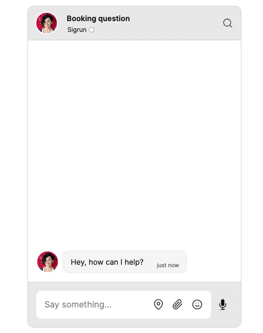
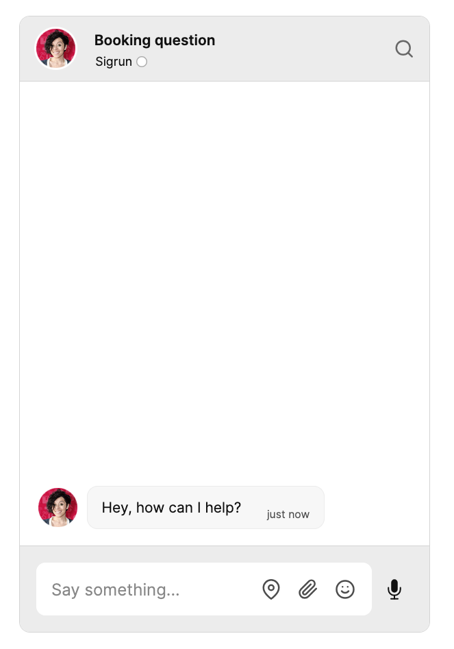

# How to add chat to your Vue app with TalkJS		

<!-- Add 'This is an older tutorial...' banner -->

This guide shows you how to add chat to your Vue app with TalkJS. If you don’t have an existing Vue app yet, you can [follow these steps to get started](https://vuejs.org/guide/quick-start.html).

<figure class="kg-image-card">
  
  <figcaption style="text-align: center;"><i>TalkJS chat in a Vue app</i></figcaption>
</figure>

## Install TalkJS

Begin by adding TalkJS to your Vue application. To install the `talkjs` package using Node Package Manager and save it as a dependency in `packages.json`, run the following command:

```shell
npm install talkjs --save
```

Alternatively, if you’re using Yarn, run the following command:

```shell
yarn add talkjs
```

You now have TalkJS installed.

## Get your app ID

For a working chat, you’ll need a TalkJS app ID. To get your unique app ID, [sign up for a TalkJS account](https://talkjs.com/dashboard/signup/premium/). You can find your app ID on the **Settings** page of your TalkJS dashboard. Hold on to your app ID, as you’ll add it in the next steps.

You can get started with TalkJS for free, and TalkJS is always free for development.

## Create a chat component

Begin by creating a Vue component for your chat, for example in a `Chat.vue` file.

Import TalkJS into your chat component, by adding the following at the start of the script section:

```js
// Chat.vue
<script setup>
  import Talk from 'talkjs';
</script>
```

Then, for either a [chatbox](https://talkjs.com/docs/Features/Chat_UI_Modes/The_Chatbox/) or an [inbox](https://talkjs.com/docs/Features/Chat_UI_Modes/The_Inbox/) pre-built chat UI, add the following container element to the template of `Chat.vue`:

```js
// Chat.vue
<template>
  <div id="talkjs-container" style="width: 100%; height: 500px">
	<i>Loading chat...</i>
  </div>
</template>
```

If you're adding a [popup](https://talkjs.com/docs/Features/Chat_UI_Modes/The_Popup_Widget/) UI, you can omit this container, as the popup gets overlaid on top of your page. By default the popup displays in the bottom right corner, but you can [change the position of the popup button on your page](https://talkjs.com/resources/how-to-customize-the-popup-open-and-close-button/).

You can then import your chat component in the place where you want it in your app, for example in `App.vue`:

```js
// App.vue
<script setup>
  import Chat from './components/Chat.vue';
</script>

<template>
  <main>
    <Chat />
  </main>
</template>
```

You now have the basis for a chat Vue component.

For a working chat, you’ll also need users and conversations between those users. Let’s create those next.

## Create users

To create a [user](https://talkjs.com/docs/Reference/Concepts/Users/) for your chat, you can use the [Talk.User() constructor function](https://talkjs.com/docs/Reference/JavaScript_Chat_SDK/User/#User__Constructor__1). `Talk.User` accepts a JSON object with the ID, name, email address, and photo URL of the user you’d like to create, among other parameters. 

In your own application, you would normally add your own user data from your database. For the purposes of this tutorial, you’ll use hardcoded sample user data. 

Add the following within the script of your `Chat.vue` file:

```js
// Chat.vue
import { onMounted } from 'vue';

onMounted(() => {
    Talk.ready.then(() => {
        
        // Create the current user 
        const me = new Talk.User({
            id: 'maryam',
            name: 'Maryam',
            email: 'maryam@example.com',
            photoUrl: 'https://randomuser.me/api/portraits/women/50.jpg',
        welcomeMessage: 'Hey, how are you?',
        });

        // Create another user 
        const other = new Talk.User({
            id: 'sigrun',
            name: 'Sigrun',
            email: 'sigrun@example.com',
            photoUrl: 'https://randomuser.me/api/portraits/women/42.jpg',
            welcomeMessage: 'Hey, how can I help?',
        });
    });
});
```

With this code you use Vue’s [`onMounted` lifecycle hook](https://vuejs.org/api/composition-api-lifecycle.html#onmounted), to make sure that the code inside it only runs when the Chat component is mounted. `Talk.ready.then` ensures that TalkJS has been loaded before executing the rest of the code. 

You then create two new users with their corresponding user details: `me`, the current user of the chat (here with the details of Maryam), and `other` for the other chat user (here with the details of Sigrun). 

## Establish a TalkJS session

To actually start the chat, you’ll need to create a chat [session](https://talkjs.com/docs/Reference/Concepts/Sessions/). Add the highlighted lines to your code:

```js {16-20}
// Chat.vue
import { onMounted } from 'vue';

onMounted(() => {
    Talk.ready.then(() => {
        
        // Create the current user
        const me = new Talk.User({
            id: 'maryam',
            name: 'Maryam',
            email: 'maryam@example.com',
            photoUrl: 'https://randomuser.me/api/portraits/women/50.jpg',
            welcomeMessage: 'Hey, how are you?',
        });

        // Start a chat session
        const session = new Talk.Session({
            appId: '<YOUR_APP_ID>',
            me: me,
        });

        // Create another user 
        const other = new Talk.User({
            id: 'sigrun',
            name: 'Sigrun',
            email: 'sigrun@example.com',
            photoUrl: 'https://randomuser.me/api/portraits/women/42.jpg',
            welcomeMessage: 'Hey, how can I help?',
        });
    });
});
```

A chat session is always associated with a unique app. Replace `YOUR_APP_ID` with your own app ID, which you can get from your [TalkJS dashboard](https://talkjs.com/dashboard/). 

## Create or join a conversation

Once you’ve got a session and users, you can create a new conversation with those users, or let them join an existing conversation. Each conversation must have a unique [conversation ID](https://talkjs.com/docs/Reference/JavaScript_Chat_SDK/Session/#Session__conversation). Conversation IDs can be stored in your database. For the purposes of this tutorial, you can hardcode the conversation ID.

To create a new conversation and add your users as participants to that conversation, add the following to your code:

```js
// Chat.vue

// Get or create a new conversation
const conversation = session.getOrCreateConversation('booking_conversation');
conversation.setAttributes({ subject: "Booking question"});

// Add users to the conversation
conversation.setParticipant(me);
conversation.setParticipant(other);
```

The `getOrCreateConversation()` function ensures that a conversation with the conversation ID you specify—in this case the conversation ID of `booking_conversation`—is available on the active session. If a conversation with the given ID already exists, it gets that conversation. If a conversation with that ID doesn’t exist yet, it creates a new conversation with that ID.

With [setAttributes](https://talkjs.com/docs/Reference/JavaScript_Chat_SDK/ConversationBuilder/#ConversationBuilder__setAttributes) you give the conversation the attribute of the subject “Booking question”. Next, you add your two users as [participants](https://talkjs.com/docs/Reference/Concepts/Participants/) to the conversation. 

## Mount the chat UI

With your users, session, and conversation now all in place, you can mount your preferred pre-built chat UI. For this tutorial you’ll add a chatbox using the [`createChatbox` method](https://talkjs.com/docs/Reference/JavaScript_Chat_SDK/Session/#Session__createChatbox), but you can also choose to add an inbox UI using [createInbox](https://talkjs.com/docs/Reference/JavaScript_Chat_SDK/Session/#Session__createInbox), or a popup UI using [createPopup](https://talkjs.com/docs/Reference/JavaScript_Chat_SDK/Session/#Session__createPopup). Add the following to your code:

```js
// Chat.vue 
// Create and mount the chat UI
const chatbox = session.createChatbox();
chatbox.select(conversation);
chatbox.mount(document.getElementById('talkjs-container'));
```

This creates a chatbox for the session, selects the conversation you’ve created, and mounts the chatbox to the div with the `talkjs-container` ID that you added in the `<template>` section. 

Run your app: 

```
npm run dev
```

You should get something like the following:

<figure class="kg-image-card">
  
</figure>

Try sending Sigrun a message! 

If the chat window doesn't show up, make sure that you entered your app ID correctly, replacing `<YOUR_APP_ID>` in the code.

You’ve now successfully added a working chat to your Vue application. 

If you like, you can customize nearly any aspect of the chat UI to match your own style using [themes](https://talkjs.com/docs/Features/Themes/), directly from the **Themes** page on your TalkJS dashboard. Moreover, you can learn more about additional TalkJS features and integrations from our [docs](https://talkjs.com/docs) and [tutorials](https://talkjs.com/resources/tag/tutorials/). 

For full example code for TalkJS chat in a Vue app, check out our [Vue getting started GitHub repo](https://github.com/talkjs/talkjs-examples/tree/master/vue/vue-getting-started).
