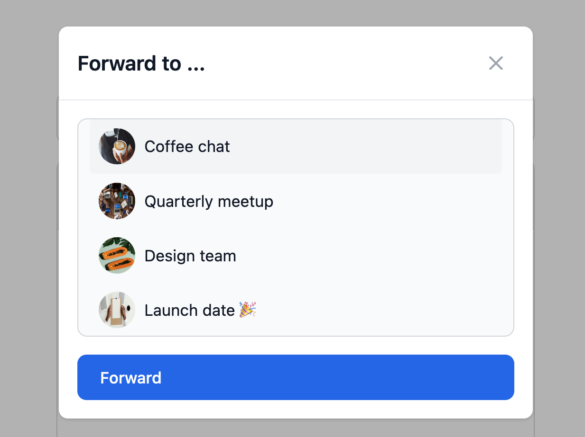

# How to add message forwarding to your chat

Forwarding a message can be a quick and easy way to share information across multiple conversations. This guide shows you step-by-step how to add the option to forward a message to your TalkJS-powered chat. 

<figure class="kg-image-card">
  
  <figcaption>A conversation with a forwarded message</figcaption>
</figure>

<!-- TODO: Add link to example project -->

If you’d rather get started immediately with a working example, check out the How to add forwarding example project on the TalkJS Github.

**Note:** This example implementation of message forwarding only supports forwarding text-based messages, not messages that are location shares, [voice messages](https://talkjs.com/docs/Features/Message_Features/Voice_Messages/), or [file attachments](https://talkjs.com/docs/Features/Message_Features/File_Sharing/). To extend the current functionality to also include forwarding files, see the information on [sending files with the REST API](https://talkjs.com/docs/Reference/REST_API/Messages/#send-a-file).


## Contents
- [Prerequisites](#prerequisites)
- [Step 1: Add a custom message action for forwarding](#step-1-add-a-custom-message-action-for-forwarding)
- [Step 2: Add a modal to select a conversation to forward to](#step-2-add-a-modal-to-select-a-conversation-to-forward-to)
- [Step 3: Load the current user’s conversations in the selection modal](#step-3-load-the-current-users-conversations-in-the-selection-modal)
- [Step 4: Enable message forwarding](#step-4-enable-message-forwarding)
- [Step 5: Style forwarded messages](#step-5-style-forwarded-messages)
- [Summary](#summary)
- [Limitation](#limitation)

## Prerequisites
To follow along with this guide, you’ll need:

- A TalkJS account. TalkJS provides a ready-to-use chat client for your application. [Get started for free.](https://talkjs.com/dashboard/signup)
- An existing chat to which you’d like to add message forwarding functionality. If you don’t have an existing project yet, follow one of the [Getting Started guides](https://talkjs.com/docs/Getting_Started/JavaScript_SDK/) to create one.
- An installation of [Node.js](https://nodejs.org/en) along with the [npm](https://www.npmjs.com/) package manager. You’ll use this to create your backend server for forwarding.

**Note:** This guide uses plain JavaScript with the [JavaScript SDK](https://talkjs.com/docs/Reference/JavaScript_Chat_SDK/), in combination with an [inbox](https://talkjs.com/docs/Features/Chat_UI_Modes/The_Inbox/) pre-built chat UI. If you prefer, you can adapt the steps to work with any front-end framework that supports JavaScript, and with a [chatbox](https://talkjs.com/docs/Features/Chat_UI_Modes/The_Chatbox/) or [popup](https://talkjs.com/docs/Features/Chat_UI_Modes/The_Popup_Widget/) pre-built chat UI.

## Step 1: Add a custom message action for forwarding

Start by adding a custom message action that someone can use to forward a message:

1. On the **Chat UI** page of your [TalkJS dashboard](https://talkjs.com/dashboard/), in the section ‘Custom message actions’, select **Add action** to add a new message action.
2. Give your action the name `forward`, and the label `Forward`.
3. Select which messages the user should be able to forward messages to, and who can do the forwarding. For the purposes of this guide, under **Which messages** select that the action should be available for `All messages`, and under **Action available to**, select `Everyone`.

If you now go to a message in your chat, and select the message action menu from the three horizontal dots on the right-hand side of the message, then the **Forward** option should show up.

<figure class="kg-image-card">
  
  <figcaption>A menu with the option to forward a message</figcaption>
</figure>

Currently the **Forward** button doesn’t do anything yet. Let’s change that, by adding a menu from which the user can select a conversation they want to forward their message to. 

## Step 2: Add a modal to select a conversation to forward to

To allow the user to select where they’d like to forward a message to, let’s add a modal dialog box from which they can select a conversation. 

This guide uses [Tailwind CSS](https://tailwindcss.com/) to style the conversation selection modal. If you’d rather use plain CSS or a different CSS framework, you can omit adding Tailwind and Tailwind-specific classes, and instead style the selection modal however you like. 

**Note:** For ease of getting started, this guide adds Tailwind with the Play CDN, which is for development purposes only and should not be used in production. If you're planning to use Tailwind in production, follow the [installation instructions](https://tailwindcss.com/docs/installation).

1. To add Tailwind to your project directly via a CDN, add the following script tag to the `<head>` of the HTML file for the page on which you have your chat, for example `index.html`: 

```html
<!-- index.html -->

<script src="https://cdn.tailwindcss.com"></script>
```

2. Add the following inside the `<body>` of the same page:

```html
<!-- index.html -->

<!-- Conversation select modal -->
<section id="forwardModal" tabindex="-1" 
   class="hidden fixed inset-0 z-50 flex items-center justify-center w-full h-full" aria-labelledby="modalTitle">

   <!-- Backdrop shadow -->
   <div class="fixed inset-0 bg-black opacity-30"></div>

   <!-- Modal content wrapper -->
   <div class="relative p-4 w-full max-w-md max-h-full">
   	<div class="relative bg-white rounded-lg shadow">
       	<!-- Modal header -->
       	<div class="flex items-center justify-between p-4 md:p-5 border-b rounded-t">
           	<h2 id="modalTitle" class="text-lg font-semibold text-gray-900">Forward to ...</h2>
           	<button type="button" onclick="closeModal()"
               	class="text-gray-400 bg-transparent hover:bg-white-200 hover:text-gray-900 rounded-lg text-sm w-8 h-8 ms-auto inline-flex justify-center items-center"
               	aria-label="Close forwarding modal"
               	data-modal-toggle="forwardModal">
               	<svg class="w-3 h-3" aria-hidden="true" xmlns="http://www.w3.org/2000/svg" fill="none"
                   	viewBox="0 0 14 14">
                   	<path stroke="currentColor" stroke-linecap="round" stroke-linejoin="round" stroke-width="2"
                       	d="m1 1 6 6m0 0 6 6M7 7l6-6M7 7l-6 6" />
               	</svg>
               	<span class="sr-only">Close</span>
           	</button>
       	</div>
       	<!-- Modal body -->
       	<form class="p-4 md:p-5" onsubmit="forwardMessage(event)">
           	<div class="grid gap-4 mb-4 grid-cols-2">
               	<div class="col-span-2">
                   	<div id="conversationList"
                       	class="bg-gray-50 border border-gray-300 text-gray-900 text-sm rounded-lg focus:ring-primary-500 focus:border-primary-500 block w-full p-2.5 overflow-y-auto h-48">
                       	<!-- Conversations will be added here dynamically -->
                   	</div>
               	</div>
           	</div>
           	<button type="submit"
               	class="w-full text-white inline-flex items-center bg-blue-600 hover:bg-blue-800 focus:ring-4 focus:outline-none focus:ring-blue-300 font-medium rounded-lg text-sm px-5 py-2.5 text-center">
               	Forward
           	</button>
       	</form>
   	</div>
   </div>
</section>
```

This code does the following:
- It adds a modal dialog box with an `id` of `forwardModal` and a header of **Forward to …**, from which users can select a conversation to forward a message to.
- It adds a dark, semi-transparent backdrop shadow to draw focus to the modal.
- The modal body creates a form to which a list with conversations gets added dynamically.
- Submitting the form triggers a `forwardMessage` JavaScript function that starts the message-forwarding process.

The modal is hidden by default. 

3. To show the modal as soon as the user selects the **Forward** custom message action, add the following to your JavaScript, for example in a `script.js` file:

```js
// script.js

// Shows a conversation selection modal
function showConversationSelectionModal() {
	document.getElementById('forwardModal').classList.remove('hidden');
}

// Handles forwarding a message (placeholder)  
function forwardMessage(event) {
	event.preventDefault();
	console.log("Forward action triggered");
	closeModal();
}

// Closes the forwarding modal
function closeModal() {
	document.getElementById('forwardModal').classList.add('hidden');
}
```

This code adds functions to show and close the forwarding modal. It also adds a placeholder for a function to forward the message. Currently this placeholder only logs a forward action trigger to the console, but you’ll be able to fill this out later.

4. Next, find your existing code in which you set up mount TalkJS chat for your app. If you’ve followed a getting started guide, this may look something like the following:

```js
// script.js

Talk.ready.then(function () {
    const me = new Talk.User({
        id: 'nina',
        name: 'Nina',
        email: 'nina@example.com',
        photoUrl: 'https://talkjs.com/new-web/avatar-7.jpg',
        welcomeMessage: 'Hi!',
    });
    const session = new Talk.Session({
        appId: 'APP_ID', // Replace with your own app ID
        me: me,
    });
    const other = new Talk.User({
        id: 'frank',
        name: 'Frank',
        email: 'frank@example.com',
        photoUrl: 'https://talkjs.com/new-web/avatar-8.jpg',
        welcomeMessage: 'Hey, how can I help?',
    });

    const conversationId = Talk.oneOnOneId(me, other);
    const conversation = session.getOrCreateConversation(conversationId);
    conversation.setParticipant(me);
    conversation.setParticipant(other);
    conversation.setAttributes({subject: "Reporting"});
    conversation.setAttributes({photoUrl: "https://www.example.com/image.jpg"});

    const inbox = session.createInbox();
    inbox.select(conversation);
    inbox.mount(document.getElementById('talkjs-container'));
});
```

Before the closing of this function, add the following code snippet:

```js
// script.js

// Handles showing the forwarding modal
inbox.onCustomMessageAction('forward', async (event) => {
   	console.log("Forward action initiated:", event);
showConversationSelectionModal();
});
```
 
This code uses the [`onCustomMessageAction` method](https://talkjs.com/docs/Reference/JavaScript_Chat_SDK/Inbox/#Inbox__onCustomMessageAction) to call the `showConversationSelectionModal` function when someone selects the **Forward** option in the custom message action menu.

Reload your page. When you now select the **Forward** message action, an empty conversation selectino modal should show up, a bit like the following: 

<figure class="kg-image-card">
  
  <figcaption>An empty modal opens when you select the option to forward a message</figcaption>
</figure>

In the modal, select the **Forward** button. You should get the message `Forward action initiated` in your console.

Right now, the modal is empty and you can’t yet select any conversation to forward a message to. Let’s change that.

## Step 3: Load the current user’s conversations in the selection modal

To allow a user to select a conversation to forward a message to, you can show them a list with all the conversations that they’re part of to select from. To get a list of all of a user’s conversations, in this step you’ll:

- Set up a basic server that can receive requests from the frontend and send requests to the TalkJS [REST API](https://talkjs.com/docs/Reference/REST_API/Getting_Started/Introduction/)
- Add an endpoint to get all of the current user’s conversations
- Load the current user’s conversations in the forwarding selection modal

Let’s begin by setting up the basic server.

### 3.1 Set up a basic server

Begin by setting up a basic server. In following this guide you'll use [Express](https://expressjs.com), which is a minimal and flexible Node.js web application framework, for this purpose.

For convenience, you can also directly install [Node Fetch](https://www.npmjs.com/package/node-fetch), to be able to use the [Fetch API](https://developer.mozilla.org/en-US/docs/Web/API/Fetch_API) to get resources, and [CORS](https://www.npmjs.com/package/cors) to support any cross-origin resource sharing, which you’ll rely on in later steps.  

1. Install the `express`, `node-fetch` and `cors` packages: 

```
npm install express node-fetch cors --save
```

2. In your `package.json` file, ensure that you have set `"type": "module"`, to be able to use [ES Modules](https://developer.mozilla.org/en-US/docs/Web/JavaScript/Guide/Modules). (Alternatively, you can use the `.mjs` extension for your server file.)
3. Create a file named `server.js` for your Express server, and add the following code:

```js
// server.js

import express from 'express';
import cors from 'cors';
import fetch from 'node-fetch';

const app = express();
const PORT = 3000;

app.use(express.json());
app.use(cors());

// Adds your app ID and TalkJS API secret key
const TALKJS_APP_ID = '<APP_ID>' // replace with your own app id
const TALKJS_API_KEY = '<API_KEY>' // replace with your own API secret key

// Starts the Express server
app.listen(PORT, () => {
   console.log(`Server is running on port ${PORT}`);
});
```

This code imports the relevant packages, and specifies a port (3000) on which your server will run. Replace the following:

- `<APP_ID>`: your own app ID 
- `<API_KEY>`: your secret key for the TalkJS REST API

You can find both your app ID and your API secret key on the **Settings** page of your [TalkJS dashboard](https://talkjs.com/dashboard/).

In your console, run: 

```shell
npm start
```

You should get a message in the console that confirms that your server is running.

You now have set up a basic server.

### 3.2 Add an endpoint to request all of a user’s conversations

Next, define an endpoint to get all conversations for a user. Specifically, you’d want to get all conversations in which the current user of the chat is a participant. 

1. To add a function that fetches all conversations for a specific user, you can use the endpoint to [List conversations a user is a part of](https://talkjs.com/docs/Reference/REST_API/Users/#list-conversations-a-user-is-a-part-of) from the REST API. Add the following code to your `server.js` file:

```js
// server.js

// Fetches conversations for a specific user
async function getUserConversations(userId) {
   const url = `https://api.talkjs.com/v1/${TALKJS_APP_ID}/users/${userId}/conversations`;

   try {
   	// Makes a GET request to TalkJS REST API
   	const response = await fetch(url, {
       	method: 'GET',
       	headers: {
           	'Authorization': `Bearer ${TALKJS_API_KEY}`,
           	'Content-Type': 'application/json',
       	},
   	});

   	if (!response.ok) {
       	throw new Error(`Error fetching conversations: ${response.statusText}`);
   	}

   	const data = await response.json();

   	// Extracts relevant fields for each conversation
   	const conversations = data.data.map(conversation => ({
       	id: conversation.id,
       	photoUrl: conversation.photoUrl,
       	subject: conversation.subject
   	}));

   	return conversations;

   } catch (error) {
   	console.error(error);
   	return { error: error.message };
   }
}
```

This code makes a GET request to TalkJS REST API to get all conversations for a given user ID. From each returned conversation, it then extracts the relevant fields—the conversation’s `id`, `subject`, and `photoUrl`—so that you can load it in the conversation selection list.

**Caution:** To ensure that the user can distinguish between conversations, the conversation list expects each conversation to have a [`photoUrl` property](https://talkjs.com/docs/Reference/JavaScript_Chat_SDK/ConversationBuilder/#ConversationBuilder__photoUrl) and a [`subject` property](https://talkjs.com/docs/Reference/JavaScript_Chat_SDK/ConversationBuilder/#ConversationBuilder__subject) set. If you prefer, you could set a default `photoUrl` as a fallback for any conversation that lacks one, as follows:

```js
photoUrl: conversation.photoUrl || 'https://www.example.com/image.jpg',
```

Setting a default `subject` is not recommended though, because it may make it difficult to distinguish one conversation from the other.

2. Next, to define a route to get conversations for a given user, using the `getUserConversations` you’ve just specified, also add the following code to your `server.js` file:

```js
// server.js

// Defines a route to get conversations for a specific user
app.get('/conversations/:userId', async (req, res) => {
   const { userId } = req.params;

   // Fetches the conversations
   const conversations = await getUserConversations(userId);

   res.json(conversations);
});
```

Restart your server for the changes to take effect.

### 3.3 Load conversations in the selection modal

To send a request to get all of the current user’s conversations when opening the modal, also make some changes to your frontend code.

1. To add a function that fetches all conversations for a given user ID from the backend, add the following code in your `script.js` file:

```js
// script.js

// Fetches all conversations for a user ID from the backend
async function fetchUserConversations(userId) {
  try {
  	const response = await fetch(`http://localhost:3000/conversations/${userId}`, {
      	method: 'GET',
      	headers: {
          	'Content-Type': 'application/json',
      	}
  	});

  	if (!response.ok) {
      	throw new Error(`Error fetching conversations: ${response.statusText}`);
  	}

  	return await response.json();
  } catch (error) {
  	console.error("Error fetching conversations:", error);
  	return [];
  }
}
```

Once the conversation data is received from the backend, you’d want to load the list of those conversations in the selection modal.

2. To load the user’s conversations in the selection modal, find the function that shows the selection modal (`showConversationSelectionModal`) in your `script.js` file, and replace it with the following: 

```js
// script.js

// Shows a modal with a list of conversations to select from 
function showConversationSelectionModal(conversations, session, messageToForward, chatbox, currentConversationId) {
  const conversationList = document.getElementById('conversationList');

  // Clears existing conversation options
  conversationList.innerHTML = '';

  // Excludes the current conversation from the list
  const filteredConversations = conversations.filter(conversation => conversation.id !== currentConversationId);

  // Populates the modal with clickable conversation options
  filteredConversations.forEach(conversation => {
  	const conversationOption = document.createElement('div');
  	conversationOption.className = "flex items-center p-2 cursor-pointer hover:bg-gray-100 rounded";

  	// Handles click events to select this conversation
  	conversationOption.onclick = function() {
    	console.log("Select conversation:", conversation.subject);
    	selectedConversationId = conversation.id;

    	// Highlights the selected conversation
    	document.querySelectorAll('#conversationList div').forEach(div => div.classList.remove('bg-gray-200'));
    	conversationOption.classList.add('bg-gray-200');
  	};

  	// Adds a conversation image and title
  	const img = document.createElement('img');
  	img.src = conversation.photoUrl;
  	img.alt = conversation.subject;
  	img.className = "w-8 h-8 rounded-full mr-2";

  	const span = document.createElement('span');
  	span.innerText = conversation.subject;
  	span.className = "text-gray-900";

  	conversationOption.appendChild(img);
  	conversationOption.appendChild(span);
  	conversationList.appendChild(conversationOption);
  });

  // Shows the modal
document.getElementById('forwardModal').classList.remove('hidden');

  // Attaches an event listener to the forward button
  document.querySelector("#forwardModal button[type='submit']").onclick = (event) => {
	forwardMessage(event, session, messageToForward, chatbox.currentConversation?.id || null);
  };
}
```

This code populates the modal with clickable conversation options, including the photo and subject of each conversation. When a conversation is selected, it gets highlighted. You'll likely don’t want to forward a message to the same conversation in which it’s already been posted, so this code excludes the current conversation from the selection list. Finally, it attaches an event listener to the **Forward** button, to forward the message to the selected conversation when the user clicks the forward button.

3. Next, find the code that handles showing the forwarding modal (currently still marked as ‘placeholder’), and replace it with the following:

```js
// script.js

// Tracks the message to be forwarded
let messageToForward = null;

// Tracks the current conversation
let currentConversationId = null;

// Add an event listener to update the current conversation
inbox.onConversationSelected((event) => {
	currentConversationId = event.conversation.id;
});

// Handles showing the forwarding modal
inbox.onCustomMessageAction('forward', async (event) => {
	console.log("Forward action initiated:", event);
	messageToForward = event.message;

	// Fetches the current user's conversations and show the modal
	const conversations = await fetchUserConversations(me.id);
	showConversationSelectionModal(conversations, session, messageToForward, inbox, conversationId);
});
```

This code ensures that when the user selects the **Forward** custom message action, that message is set as the one to forward, and it’ll list the modal with all of the user’s conversations.

4. To be able to process the user’s selection, find the code that handles the forwarding of a message (also still marked as ‘placeholder’), and replace it with the following:

```js
// script.js

// Handles the forwarding of a message (placeholder)
function forwardMessage(event) {
	// Prevents the default form submission behavior
	event.preventDefault();

	// Ensures that a conversation has been selected
	if (!selectedConversationId) {
    	alert("Select a conversation to forward the message to.");
    	return;
	}

	// Logs the selected conversation ID to the console
	console.log("Selected conversation ID:", selectedConversationId);

	// Resets the selected conversation ID and close the modal
	selectedConversationId = null;
	closeModal();
}
```

You’re not forwarding messages quite yet, but when you now select a conversation from the list, your selection is logged to the console.

5. Reload your page. If you now open the modal, it will show a list of the user’s conversations, a bit like the following:

<figure class="kg-image-card">
  
  <figcaption>A conversation selection modal with a list of the user’s conversations</figcaption>
</figure>

(The exact list will depend on which conversations the current user is part of.) 

When you now select a conversation and click **Forward**, you should get a message in your console with the conversation ID of your selected conversation.

## Step 4: Enable message forwarding

Now that you can select a conversation to forward a message to, the next step is to add the actual forwarding behavior.

To do so, in this step you’ll add an endpoint to forward a message to a selected conversation and make sure that the message is correctly sent to the selected conversation.

### 4.1 Add an endpoint to forward a message to a selected conversation

Begin by adding an endpoint to handle forwarding a message to a selected conversation. 

1. To add an endpoint to handle forwarding a message to a selected conversation, add the following code to your `server.js` file:

```js
// server.js

// Endpoint to handle forwarding a message to a selected conversation
app.post('/forward-message', async (req, res) => {
	console.log("Received POST request:", req.body);

	const { messageText, senderId, conversationId, conversationOrigin } = req.body;

	// Prepares the request body for the TalkJS REST API
	const requestBody = [
    	{
        	"text": messageText,
        	"sender": senderId,
        	"type": "UserMessage",
        	"custom": {
            		"forwardedFrom": conversationOrigin,
        	}
    	}
	];

	console.log(requestBody);

    
	// Constructs the URL to send a message to the selected conversation
	const url = `https://api.talkjs.com/v1/${TALKJS_APP_ID}/conversations/${conversationId}/messages`;

	try {
    	// Makes a POST request to the TalkJS REST API to send the message
    	const response = await fetch(url, {
        	method: 'POST',
        	headers: {
            	'Content-Type': 'application/json',
            	'Authorization': `Bearer ${TALKJS_API_KEY}`
        	},
        	body: JSON.stringify(requestBody)
    	});

    	const responseText = await response.text();

    	if (!response.ok) {
        	console.error("TalkJS REST API error:", response.status, responseText);
        	return res.status(response.status).json({ success: false, message: "Failed to send message", error: responseText });
    	}

    	const responseData = JSON.parse(responseText);
    	console.log("Message sent successfully via the REST API:", responseData);

    	// Responds back to the client
    	res.json({ success: true, message: "Message forwarded and sent", data: responseData });

	} catch (error) {
    	console.error("Error sending message via the REST API:", error);
    	res.status(500).json({ success: false, message: "Internal server error" });
	}
});
```

This code prepares the request body for the message to be forwarded, and sends a POST request to the TalkJS REST API to send the message.

In forwarding a message, you only need to send specific data when preparing the request body. Specifically, in this case you specify:

- `text` – the body text of the message, which you get directly from the message that the user chose to forward
- `sender` – the user ID of the current user who is forwarding the message
- `type` – the message type of the message to send. You can forward both [user messages](https://talkjs.com/docs/Reference/Concepts/Messages/) and [system messages](https://talkjs.com/docs/Reference/Concepts/System_Messages/), but because you'll send the message on behalf of the current user, the message type here is set to `UserMessage`.
- `custom` – a [custom property](https://talkjs.com/docs/Reference/Concepts/Messages/#custom) of a message. To identify messages that have been forwarded, this adds the custom property `forwardedFrom`, with as a value the ID of the conversation in which the message was originally posted. You can use this custom property later on to pick out forwarded messages and style them differently.

You now have added an endpoint to handle forwarding a message to a selected conversation. Restart your server for the changes to take effect.

### 4.2 Send message details to be forwarded to the backend

In this step, you’ll update the function to forward the message through the backend.

1. To send the relevant data for the to-be-forwarded message via the backend, add the following to your `script.js` file:

```js
// script.js

// Sends a message to be forwarded to a selected conversation via the backend
async function forwardMessageToBackend(session, conversationId, messageToForward, conversationOrigin) {
	try {

    	// Prepares the request body with the message, conversation, and sender details
    	const requestBody = {
        	messageText: messageToForward.body,
        	senderId: session.me.id,
        	conversationId: conversationId,
        	conversationOrigin: conversationOrigin,
    	};

    	// Sends the message to the backend for forwarding
    	const response = await fetch('http://localhost:3000/forward-message', {
        	method: 'POST',
        	headers: {
            	'Content-Type': 'application/json'
            	},
        	body: JSON.stringify(requestBody)
    	});

    	const data = await response.json();
    	console.log("Message forwarded successfully:", data);
	} catch(error) {
    	console.error("Error forwarding message:", error);
	}
}
```

2. Also in `script.js`, find the placeholder code where you currently handle the forwarding of a message and log the selected conversation ID to the console. Update this to use the `forwardMessageToBackend` function, as follows:

```js
// script.js

// Handles the forwarding of a message
function forwardMessage(event, session, messageToForward, conversationOrigin) {
	// Prevents the default form submission behavior
	event.preventDefault();

	// Ensures that a conversation has been selected
	if (!selectedConversationId) {
    	alert("Please select a conversation to forward the message to.");
    	return;
	}

	// Forwards the message using the selected conversation ID
	forwardMessageToBackend(session, selectedConversationId, messageToForward, conversationOrigin);

	// Resets the selected conversation ID and close the modal
	selectedConversationId = null;
	closeModal();
}
```

3. Reload your page. If you now select a conversation and submit your selection with the **Forward** button, you should get a `Message forwarded successfully` message in your console, and your message gets forwarded to the selected conversation. 

You’ve successfully set up message forwarding! But the forwarded message looks exactly like any other message, so it’s not clear that it has been forwarded.

Let’s make forwarded messages stand out a bit more.

## Step 5: Style forwarded messages

In this step, you'll add styling in your theme to distinguish forwarded messages from other messages, using the [Theme editor](https://talkjs.com/docs/Features/Themes/The_Theme_Editor/). You’ll add a subtle but noticeable right-pointing arrow and an italicized label *Forwarded* at the top of the message body of forwarded messages.

1. On the **Themes** page of your dashboard, select **Edit** for the theme that you’d like to use.
2. To identify user messages that have been forwarded based on their `forwardedFrom` custom property, in the [`UserMessage` component](https://talkjs.com/docs/Features/Themes/Components/UserMessage/), add the following to the `<template>` part of the code:

```html
<!-- TalkJS theme editor, UserMessage component -->

<!-- Check for forwarded messages -->
<div t:if="{{ custom.forwardedFrom }}" class="{{ 'forwarded' }}"></div>
```

This dynamically adds the value `forwarded` to the CSS class for any message that has the custom property `forwardedFrom` set.

3. Still in `UserMessage`, find the section where it includes the `MessageBody`, and add `forwardedFrom="{{custom.forwardedFrom}}"` to its props, as follows:
```html
	<MessageBody
		body="{{ body }}"
		timestamp="{{ timestamp }}"
		floatTimestamp="auto"
		showStatus="{{ sender.isMe }}"
		isLongEmailMessage="{{isLongEmailMessage}}"
		darkenMenuArea="{{ darkenMenuArea }}"
		referencedMessage="{{ referencedMessage }}"
		forwardedFrom="{{custom.forwardedFrom}}"
	/>
```
4. Then, to style the message body of a forwarded message, go to the [`MessageBody` subcomponent](https://talkjs.com/docs/Features/Themes/Components/MessageBody/) and add the following inside the `<template>` section:

```html
<!-- TalkJS theme editor, MessageBody subcomponent -->

<div t:if="{{ forwardedFrom }}">
    <div class="forwarded-header">
        <svg xmlns="http://www.w3.org/2000/svg" xmlns:xlink="http://www.w3.org/1999/xlink" version="1.1" x="0px" y="0px" viewBox="0 0 100 125" style="enable-background:new 0 0 100 100;" xml:space="preserve">
            <path d="M56.8,31.5V16c-0.1-0.8,0.1-1.6,0.7-2.2c1-1,2.7-1,3.8,0l32.4,28.9c0.6,0.6,0.8,1.3,0.8,2c0,0.7-0.2,1.5-0.8,2L61.4,75.5 c-0.5,0.6-1.2,1-2,1c-0.7,0-1.4-0.3-1.9-0.8c0,0,0,0,0,0c-0.6-0.6-0.8-1.4-0.7-2.2c0,0,0-14.6,0-15.5c-17.4,0-33.6-1.1-50.3,22.1 C3.3,84.3,5.8,31.3,56.8,31.5z" fill="#FFFFFF" opacity="0.8"/>
        </svg>
        <span class="forwarded-indicator">Forwarded</span>
    </div>
</div>
```

Still in `MessageBody`, add the following styles to the `<styles>` section:

```css
/* TalkJS theme editor, MessageBody subcomponent */

/* Styles for forwarded messages */
.forwarded-header {
    display: flex;
    align-items: center;
    margin-top: 0.5rem;
    margin-left: 0.5rem;
}

.forwarded-header svg {
    width: 1.5rem;
    height: 1.5rem;
    margin-right: 0.3rem;
}

.forwarded-indicator {
    color: #ffffff;
    font-style: italic;
    opacity: 0.8;
}
```

Your changes are automatically saved. All forwarded messages will now get distinctive styling, which should look something like the following:

<figure class="kg-image-card">
  
  <figcaption>An example of a forwarded message with custom styling</figcaption>
</figure>

That’s it! You now have a working chat in which your users can forward messages.

## Summary

In this guide, you’ve:
- Added a custom message action as a starting point for forwarding.
- Added a conversation selection modal that loads the current user’s existing conversations, from which they can select which conversation to forward a message to.
- Set up a backend that uses the REST API to forward the message to the selected conversation.
- Styled forwarded messages so that they stand out as having been forwarded.
