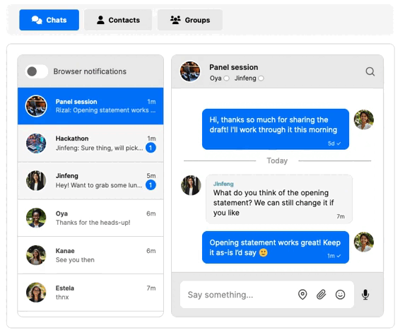
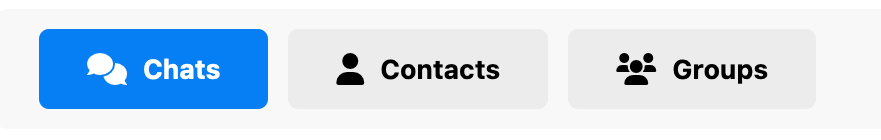
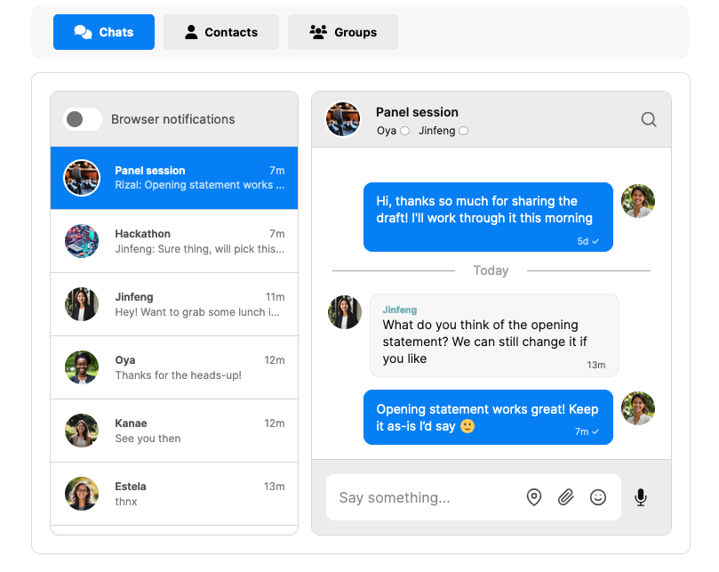

# How to add tabs to your inbox

With many conversations going on, you might want to offer your users a way to easily switch between chats. For example, you might offer an option to quickly get all contacts, or to chat with a different team.

This guide will show you how to add tabs to your inbox UI that allow users to switch between the following overviews:

- **Chats** for an overview of all conversations
- **Contacts** for all direct messages with individual contacts
- **Groups** for all groups chats

You can of course use a different set of tabs, and tailor the filters associated with each tab to fit your own use case.

<figure class="kg-image-card">
    
</figure>

## Prerequisites

To follow along with this guide, make sure you have:

- A [TalkJS account](https://talkjs.com/dashboard/login).
- An existing chat using the [inbox pre-built chat UI](https://talkjs.com/docs/Reference/JavaScript_Chat_SDK/Inbox/) to which you would like to add tabs.

This guide uses the [JavaScript SDK](https://talkjs.com/docs/Reference/JavaScript_Chat_SDK/) to add the tabs, but can be adapted to other SDKs as well.

## Step 1: Add tabs for filtering

Begin by adding the tab buttons themselves. 

1. In the HTML for your site or app where you’ve added TalkJS chat, find the lines in which you added the container in which to load TalkJS inbox. It’ll likely look as follows:

```HTML
<div id='talkjs-container'>
    <i>Loading chat...</i>
</div>
```

2. Add HTML to create tab buttons for navigation, for example with the following code:

```HTML
<div id="main-wrapper">
    <div id="tab-navigation">
        <button id="tab-chat" class="tab active-tab">Chats</button>
        <button id="tab-contacts" class="tab">Contacts</button>
        <button id="tab-groups" class="tab">Groups</button>
    </div>
    <div id="talkjs-container">
        <i>Loading...</i>
    </div>
</div>
```

This code adds three tab buttons right above the conversation list header: one for chats, one for contacts, and one for groups. 

3. Style your tab buttons. The following code uses default TalkJS colors and styling, and includes Font Awesome icons to distinguish the tabs:

```HTML
<link rel="stylesheet" href="https://cdnjs.cloudflare.com/ajax/libs/font-awesome/6.0.0-beta3/css/all.min.css">

<div id="main-wrapper">
    <div id="tab-navigation">
        <button id="tab-chat" class="tab active-tab"><i class="fas fa-comments"></i> Chats</button>
        <button id="tab-contacts" class="tab"><i class="fas fa-user"></i> Contacts</button>
        <button id="tab-groups" class="tab"><i class="fas fa-users"></i> Groups</button>
    </div>
    <div id="talkjs-container">
        <i>Loading...</i>
    </div>
</div>

<style>
#main-wrapper {
  width: 700px;
  margin: 10px auto;
}

#tab-navigation {
  display: flex;
  justify-content: flex-start;
  background-color: #f8f8f8;
  border-radius: 10px;
  padding: 10px 20px;
  margin-bottom: 15px;
  width: 100%;
}

.tab {
  padding: 12px 24px;
  cursor: pointer;
  border: none;
  background-color: #ececec;
  border-radius: 5px;
  font-weight: bold;
  transition: background-color 0.2s ease;
  display: flex;
  align-items: center;
  margin: 0px 5px;
  gap: 8px;
}

.tab i {
  font-size: 16px;
}

.tab:hover {
  color: #007DF9;
}

.active-tab {
  background-color: #007DF9;
  color: white;
}

.active-tab:hover {
  background-color: #014e9b;
  color: white;
}

#talkjs-container {
  height: 500px;
  width: 100%;
  background-color: #ffffff;
  border: 1px solid #dcdcdc;
  border-radius: 10px;
  padding: 20px;
}
</style>
```

You now have three styled tab buttons for all chats, contacts, and groups above your conversation list. 

<figure class="kg-image-card">

<figcaption>Tab buttons for chats, contacts, and groups</figcaption>
</figure>

The buttons don’t do anything yet. Let’s change that in the next steps.

## Step 2: Set custom conversation properties for filtering

To make sure that each tab shows the correct selection of conversations in the conversation list, you can use [conversation list filters](https://talkjs.com/docs/Features/Conversation_Features/Conversation_List_Filters/). 

This guide will use the tab buttons to filter conversations in the conversation list based on their type, namely whether a conversation is a 1-on-1 chat (direct messaging) with a contact, or a group chat. While `type` isn’t a built-in property of conversations, you can add this property yourself using [custom conversation properties](https://talkjs.com/docs/Reference/JavaScript_Chat_SDK/ConversationBuilder/#ConversationBuilder__custom). For example, you could set the custom conversation property to `dm` for direct messages, and to `group` for group chats. 

You can add a custom property to a conversation in several ways, including with the REST API, or when creating or updating a conversation with the JavaScript SDK.

### Option 1: Add a custom conversation type property with the JavaScript SDK 

You could automatically set the conversation property type directly when creating a conversation using the JavaScript SDK. For example, in the following code snippet for creating a conversations, the highlighted code adds the custom property of `type` to all conversations, and sets it to the value `group` for conversations with more than two participants, and to `dm` otherwise: 

```JS
Talk.ready.then(function () {

   // Define current user
   const me = new Talk.User({
     id: "rizal",
     name: "Rizal",
     email: "rizal@example.com",
     });
  
   // Initialize the TalkJS session
   const talkSession = new Talk.Session({
     appId: '<APP_ID>',
     me: me,
   });

   // Add other user
   const oya = new Talk.User({
     id: 'oya',
     name: 'Oya',
     email: "oya@example.com",
   });

   const jinfeng = new Talk.User({
       id: 'jinfeng',
       name: 'Jinfeng',
     	email: "jinfeng@example.com",
   });

    // Get or create the conversation
   const conversation = talkSession.getOrCreateConversation('summer-hike');
  
   // Set the conversation participants
   conversation.setParticipant(me);
   conversation.setParticipant(oya);
   conversation.setParticipant(jinfeng);

    // Function to add the conversation type
   function updateConversationType(conversation) {
     const participantCount = Object.keys(conversation.participants).length;
     console.log(conversation.participants);

      // Set the conversation type based on the number of participants 
     const conversationType = participantCount > 2 ? 'group' : 'dm';
    
     // Update the custom attribute 'type' on the conversation
     conversation.setAttributes({
       custom: { type: conversationType }
     });
   }

    // Create the inbox, select the conversation, mount the UI
   const inbox = talkSession.createInbox();
   inbox.select(conversation);
   inbox.mount(document.getElementById('talkjs-container'));
 });
```

In this code snippet, replace `<APP_ID>` with your own app ID.

**Note:** The function in the above code snippet sets the conversation type based on the number of conversation participants. It doesn’t detect [guest users](https://talkjs.com/docs/Reference/Concepts/Guests/) of a conversation.

### Option 2: Add a custom conversation property with the REST API

To set a custom property on a conversation using the REST API, you can use the [Setting conversation data](https://talkjs.com/docs/Reference/REST_API/Conversations/#setting-conversation-data) option. For example, to identify group chats, you could add a custom conversation property of type `group` to all conversations with more than two participants, as follows:

```JSON
"custom": {
	"type": "group"
  }
```

Using either the REST API or the JavaScript SDK, you now have made sure that your conversations have the custom property `type` set to either `dm` or `group`, depending on the number of conversation participants.

You can now use the custom conversation property `type` to filter the conversation list based on which tab the user selects. This way, switching between tabs allows the user to switch between showing either all chats, only 1-on-1 conversations with their contacts, or only group chats.

## Step 3: Add filtering to your tabs

Next, add filtering capacity to your tabs. 

To filter conversations shown in each tab based on their `type` (in this case: `dm` or `group`), you could use the following updated code snippet:

```JS
Talk.ready.then(function () {

   // Define current user
   const me = new Talk.User({
     id: "rizal",
     name: "Rizal",
     email: "rizal@example.com",
     });
  
   // Initialize the TalkJS session
   const talkSession = new Talk.Session({
     appId: '<APP_ID>',
     me: me,
   });

   // Add other user
   const oya = new Talk.User({
     id: 'oya',
     name: 'Oya',
     email: "oya@example.com",
   });

   const jinfeng = new Talk.User({
       id: 'jinfeng',
       name: 'Jinfeng',
     	email: "jinfeng@example.com",
   });

    // Get or create the conversation
   const conversation = talkSession.getOrCreateConversation('summer-hike');
  
   // Set the conversation participants
   conversation.setParticipant(me);
   conversation.setParticipant(oya);
   conversation.setParticipant(jinfeng);

    // Function to add the conversation type
   function updateConversationType(conversation) {
     const participantCount = Object.keys(conversation.participants).length;
     console.log(conversation.participants);

      // Set the conversation type based on the number of participants 
     const conversationType = participantCount > 2 ? 'group' : 'dm';
    
     // Update the custom attribute 'type' on the conversation
     conversation.setAttributes({
       custom: { type: conversationType }
     });
   }

// Define filters for each tab 
const filters = {
   chat: {},
   contacts: { custom: { type: ["==", "dm"] } },
   groups: { custom: { type: ["==", "group"] } }
};

// Set chat as the default tab
let tab = 'chat';

// Handle tab switching
const tabButtons = {
    'tab-chat': 'chat',
    'tab-contacts': 'contacts',
    'tab-groups': 'groups',
};

Object.keys(tabButtons).forEach(tabId => {
  document.getElementById(tabId).addEventListener("click", () => {
      tab = tabButtons[tabId];
      inbox.setFeedFilter(filters[tab]);
      inbox.select(null);
      setActiveTab(tabId);
  });
});

// Set active tab style
function setActiveTab(activeTabId) {
   document.querySelectorAll('.tab').forEach(tab => tab.classList.remove('active-tab'));
   document.getElementById(activeTabId).classList.add('active-tab');
}

   // Create the inbox with a filter 
   const inbox = talkSession.createInbox();
   inbox.select(conversation);
   inbox.setFeedFilter(filters[tab]);
   inbox.mount(document.getElementById('talkjs-container'));
 });
```

Replace `<APP_ID>` with your own app ID. 

(If you’re using the REST API to create and update your conversations, you can omit the parts of this code that set user data. See for example: [Viewing an existing conversation](https://talkjs.com/docs/Getting_Started/JavaScript_SDK/1_On_1_Chat/#view-an-existing-conversation).)

In this code snippet, the highlighted code defines filters for each tab, and applies the correct filter to the conversation list of the inbox whenever a user selects that tab. It sets the **Chat** tab as the default.

To try out the tab filters in action, make sure that your current user has at least one conversation of each type: a 1-on-1 chat with a contact, and a group chat. Once the user is a participant in these conversations, the **Chats** tab should show the user all their conversations, while **Contacts** tab only shows the one-on-one conversation, and the **Groups** tab shows only the group conversation.

<figure class="kg-image-card">

<figcaption>Inbox UI with filter tabs for all chats, direct messages with contacts, and group chats</figcaption>
</figure>

You’ve now added working tab buttons with filters to your chat, which allow your user to easily switch between conversations of different types, and as a result quickly find what they’re looking for. 

---

Do you have questions about adding tabs to your inbox? We’re happy to help. [Get in touch.](https://talkjs.com/?chat)