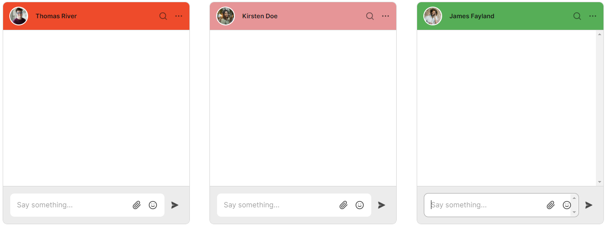
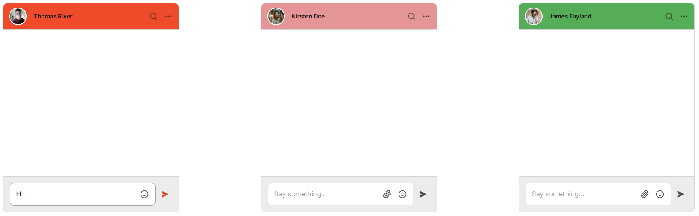

# How to use custom data to style your TalkJS chat

You might often have situations where you want to style your chat differently for different users. For example, imagine you run a marketplace where you want different accent colors for different sellers. Creating a theme for each seller would result in an unmanageable number of themes.

TalkJS gives you the option to [pass custom data to your theme](https://talkjs.com/docs/Features/Themes/Passing_Data_to_Themes). You can then access this data as a [CSS custom property](https://developer.mozilla.org/en-US/docs/Web/CSS/Using_CSS_custom_properties) in the Theme Editor and use it to style your chat.


<figure class="kg-image-card">
  
  <figcaption>You can style chats using custom data without creating multiple themes.</figcaption>
</figure>

In this tutorial, we're going to showcase three chats each with a different `accentColor` passed to the theme and rendered differently. The following sections highlight the main topics that we'll cover:

* Passing custom data to the chatboxes
* Using the custom data in the TalkJS theme

To follow along, you’ll need:

- A [TalkJS account]|(https://talkjs.com/dashboard/login). TalkJS provides a ready-to-use chat client for your application. Your account gives you access to TalkJS's free development environment.
- An existing TalkJS project using the [JavaScript Chat SDK](https://talkjs.com/docs/Reference/JavaScript_Chat_SDK/). See our [Getting Started]|(https://talkjs.com/docs/Getting_Started/) guide for an example of how to set this up.

We’ll build up the feature step by step in the following sections. If you would rather see the complete example code, see the [GitHub repo](https://github.com/talkjs/talkjs-examples/tree/master/howtos/how-to-use-custom-data-to-style-your-talkjs-chat) for this tutorial.

## Creating and setting the theme for your chat

Go to your TalkJS dashboard, and navigate to the **Themes** tab. Click **Create new theme** and enter "customDataToTheme" as the theme name. Select to base your new theme on the "default" theme and click **Create**.

Now, navigate to the **Chat UI** tab and select the default role. Select the **customDataToTheme** theme and click **Publish to live** to apply this theme to your default role.

For our example we'll first create three chatboxes side-by-side. This isn't a realistic example, but it makes it easy to demonstrate what different styling choices will look like. In your real app you will instead show a single chat to a given user.

If you followed our [Getting Started](https://talkjs.com/docs/Getting_Started/) guide, you'll have a single div with the id `talkjs-container`. There are also some inline styles applied to this div. You must replace this HTML code with the block given below.

```html
<div class="container">
  <div id="talkjs-container-1" class="column">
    <i>Loading chat...</i>
  </div>
  <div id="talkjs-container-2" class="column">
    <i>Loading chat...</i>
  </div>
  <div id="talkjs-container-3" class="column">
    <i>Loading chat...</i>
  </div>
</div>
```

### Moving the inline styles to a stylesheet

Notice how we've moved the inline styles out into a stylesheet. For this, you must create a `styles.css` file in the project directory and paste the following styles. If you cloned the Github project, you can skip this step.

```css
.container {
    display: flex;
    justify-content: space-between;
    height: 500px;
    margin: 30px;
}
.column {
    flex: 1;
}
```

To reference the `styles.css` file in your `index.html` file, paste the following line in the `<head>` section.

```html
<link rel="stylesheet" href="styles.css">
```

## Passing custom data to the chatboxes

In this section, we'll pass a custom attribute called `accentColor` while creating the chatbox. This is then used in the subsequent section to change the colors of the chatbox in our theme.

Inside the `index.js` file we'll create four users in total, to demonstrate one user talking to three other users.

```javascript
const me = new Talk.User({
id: "0001",
name: "Mikaela Ross",
email: "mikaela.ross@example.com",
photoUrl: "https://talkjs.com/images/avatar-7.jpg",
role: "default"
});

const other1 = new Talk.User({
id: "0002",
name: "Thomas River",
email: "thomas.river@example.com",
photoUrl: "https://talkjs.com/images/avatar-5.jpg",
role: "default"
});

const other2 = new Talk.User({
id: "0003",
name: "Kirsten Doe",
email: "kirsten.doe@example.com",
photoUrl: "https://talkjs.com/images/avatar-1.jpg",
role: "default"
});

const other3 = new Talk.User({
id: "0004",
name: "James Fayland",
email: "james.fayland@example.com",
photoUrl: "https://talkjs.com/images/avatar-4.jpg",
role: "default"
});
```

After creating four users, we create three conversations. We set the participants for each of these conversations.

```javascript
let conversation1 = talkSession.getOrCreateConversation("customStyleChat1");
let conversation2 = talkSession.getOrCreateConversation("customStyleChat2");
let conversation3 = talkSession.getOrCreateConversation("customStyleChat3");

conversation1.setParticipant(me);
conversation1.setParticipant(other1);

conversation2.setParticipant(me);
conversation2.setParticipant(other2);

conversation3.setParticipant(me);
conversation3.setParticipant(other3);
```

Next, we create three chatboxes and [pass data to the theme](https://talkjs.com/docs/Features/Themes/Passing_Data_to_Themes/#pass-custom-data-directly-to-the-theme).

In this example we've used custom data with a single `accentColor` attribute, but you can change it to whatever makes sense for you.

```javascript
const chatbox1 = talkSession.createChatbox({
  theme: {
    custom: {
      accentColor: '#EE4B2B',
    },
  },
});

const chatbox2 = talkSession.createChatbox({
  theme: {
    custom: {
      accentColor: '#E69597',
    },
  },
});

const chatbox3 = talkSession.createChatbox({
  theme: {
    custom: {
      accentColor: '#56AE57',
    },
  },
});
```

In this example we've set the colors directly. In a more realistic example, you may instead want to pass in a variable that you set based on, for example, the current user or page.

Lastly, we select the created conversations and mount the three chatboxes.

```javascript
chatbox1.select(conversation1);
chatbox2.select(conversation2);
chatbox3.select(conversation3);
  
chatbox1.mount(document.getElementById("talkjs-container-1"));
chatbox2.mount(document.getElementById("talkjs-container-2"));
chatbox3.mount(document.getElementById("talkjs-container-3"));
```

## Using the custom data in the TalkJS theme

After passing the `accentColor` attribute to your chatbox, you can now use it in your theme's code. This makes it easier to style your chats differently by passing [custom attributes](https://talkjs.com/docs/Features/Themes/Passing_Data_to_Themes/#using-custom-values-for-styling).

Go to your TalkJS dashboard, and navigate to the **Themes** tab. Click **Edit** next to the "customDataToTheme" theme. Go to the **UserMessage** component and find the `.by-me .message` CSS class. Change the values of the `border-color` and `background-color` properties to `var(--theme-accentColor)`.

Now, go to the **MessageField** component and find the following CSS class.

```css
.is-typing .send-button,
.record-button:hover,
.location-button:hover,
.attachment-button:hover,
.emoji-button:hover
```

Change the value of the `color` property to `var(--theme-accentColor);`.

Lastly, go to the **ChatHeader** component and find the `header` CSS class. Change the value of the `background-color` CSS property to `var(--theme-accentColor)`. TalkJS autosaves all your changes automatically.

## Conclusion

<figure class="kg-image-card">
  
  <figcaption>Each chat is styled differently based on the data passed to the theme.</figcaption>
</figure>

You now know how to use custom data to style your TalkJS chat. To recap, in this tutorial you have:

- Passed custom data while creating chatboxes
- Accessed the custom data in your TalkJS theme
- Styled different components using the custom data

For the full example code for this tutorial, see our [GitHub repo](https://github.com/talkjs/talkjs-examples/tree/master/howtos/how-to-use-custom-data-to-style-your-talkjs-chat).

If you want to learn more about TalkJS, here are some good places to start:

- The [TalkJS docs](https://talkjs.com/docs/) help you get started with TalkJS.
- [TalkJS tutorials](https://talkjs.com/resources/tag/tutorials/) provide how-to guides for many common TalkJS use cases.
- The [talkjs-examples GitHub repo](https://github.com/talkjs/talkjs-examples) has larger complete examples that demonstrate how to integrate with other libraries and frameworks.